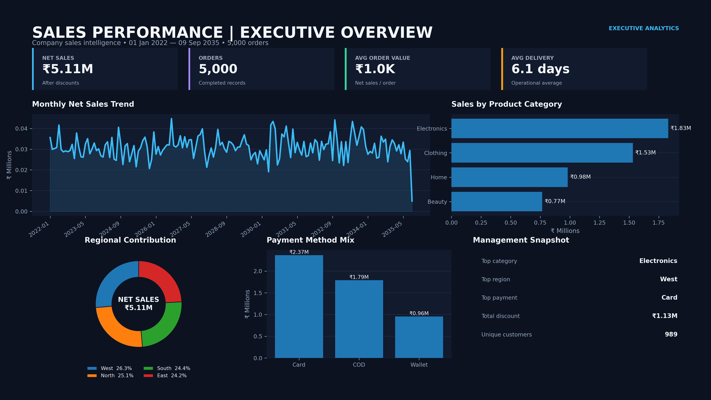
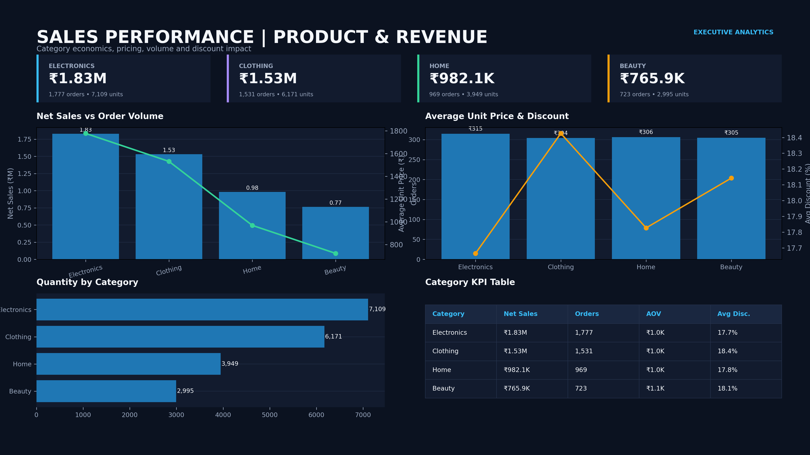
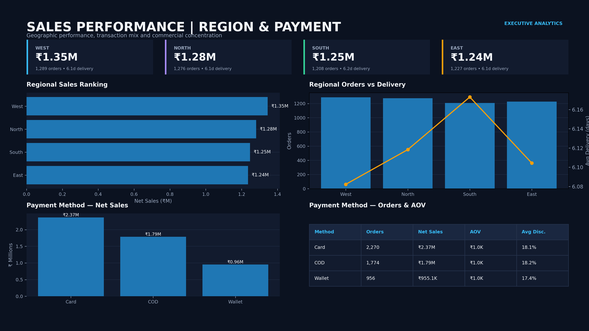
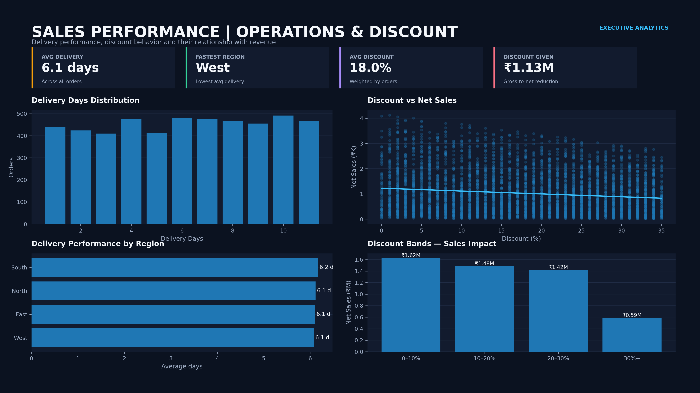
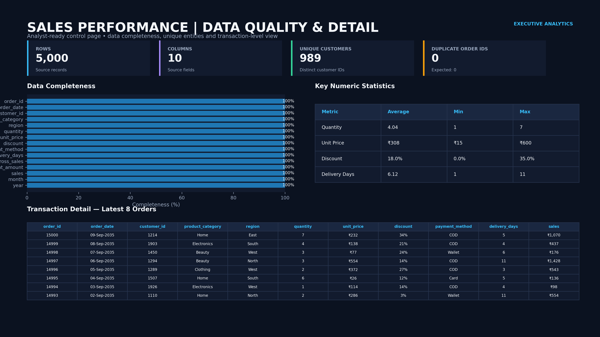

# Sales Performance Analytics — End-to-End Project

A full analytics pipeline on a 5,000-order transactional sales dataset, taken through **Excel → SQL → Python (Pandas) → Power BI**, with every KPI cross-checked across tools and a full written report.

**[📄 Read the full project report](./report/Sales_Performance_Analytics_Report.docx)**

---

## Why this project stands out

Most portfolio "sales dashboard" projects stop at pretty charts. This one goes a step further: I ran the **same numbers through four different tools and compared them**.

That's the point of the project: not just "here's a dashboard," but "here's how cross-validating a pipeline catches errors a single tool won't."

---

## Workflow

```
Raw Data (CSV)
      │
      ▼
Excel Cleaning ──── standardize date type, add net-sales calculated field
      │
      ▼
SQL Analysis ──────  21 queries: performance, category, customer, region,
      │              payment, time-based, operational (PostgreSQL)
      ▼
Python / Pandas ──── validation, feature engineering, correlation analysis
      │
      ▼
Power BI ──────────  5-page interactive dashboard suite
      │
      ▼
Written Report ────  21-section business report with findings & recommendations
```

## Key results

| KPI | Value |
|---|---|
| Net Sales | ₹5.11M |
| Total Orders | 5,000 |
| Average Order Value | ₹1,022 |
| Unique Customers | 989 (96% repeat buyers) |
| Average Discount | 18.0% |
| Average Delivery Time | 6.12 days |
| Top Category | Electronics (₹1.83M) |
| Top Region | West (₹1.35M) |

## Key insights

- **No single segment dominates** — category revenue spans ₹0.77M–₹1.83M, regional revenue is even tighter (within 9%).
- **Discounting is negatively correlated with net sales** (r ≈ −0.14); the 30%+ discount band produced the *lowest* net sales of any band.
- **No measurable time trend** across the 14.7-year window (r ≈ 0.004 between time and monthly sales) — a finding that shaped how I framed the trend section instead of overstating a pattern that isn't there.
- **Revenue is broadly distributed across customers** — the top 5 customers account for only ~1.5% of total net sales.

Full evidence, methodology, and business recommendations are in the [report](./report/Sales_Performance_Analytics_Report.docx).

---

## Dashboards (Power BI)

**Executive Overview**


**Product & Revenue**


**Region & Payment**


**Operations & Discount**


**Data Quality & Detail**


---

## Repository structure

```
├── data/
│   ├── raw/                        # Original, unmodified source file
│   └── cleaned/                    # Excel-cleaned, SQL-input, and final Python output
├── sql/
│   ├── sales_analysis_queries.sql            # Original 21-query analysis file
├── python/
│   └── sales_data_cleaning_and_eda.py        # Cleaning, validation, feature engineering
├── dashboards/                     # Power BI dashboard exports (5 pages)
├── report/
│   └── Sales_Performance_Analytics_Report.docx   # Full 21-section written report
└── README.md
```

## Tools used

`Excel` · `SQL (PostgreSQL)` · `Python (Pandas)` · `Power BI`

## Reproducing the analysis

```bash
pip install pandas
python python/sales_data_cleaning_and_eda.py
```

The script loads the raw CSV, runs data-quality checks, engineers `gross_sales`, `discount_amount`, `sales_amount`, `year`, `month`, and `month_name`, and exports the cleaned file used for the SQL queries and Power BI dashboards.

---

*Dataset is illustrative/generated for portfolio purposes — see the report's Limitations section for details on data characteristics.*

